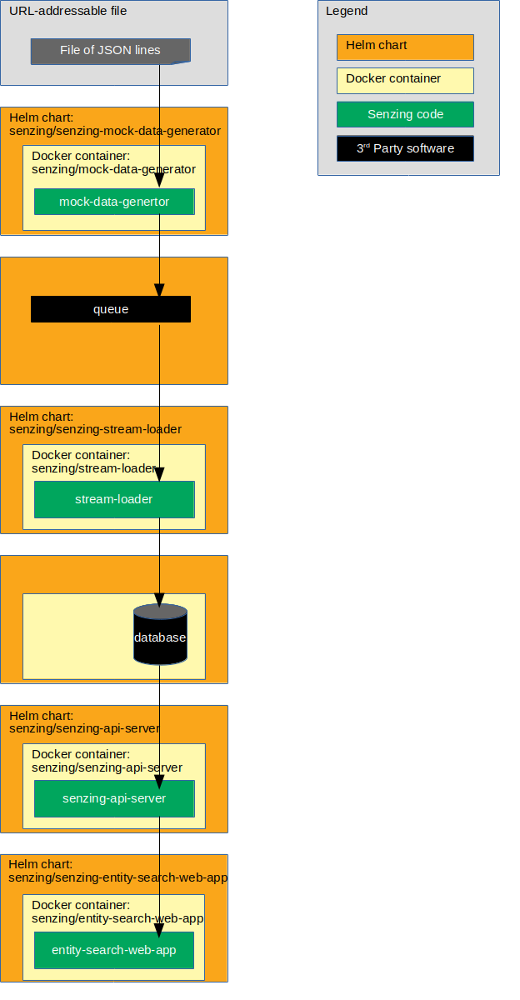

# ibm-openshift-guide

## Overview

This repository illustrates a reference implementation of
[Senzing](https://senzing.com) on
[IBM Cloud Pak for Data](https://www.ibm.com/products/cloud-pak-for-data).

The instructions show how to set up a system that:

1. Reads JSON lines from a file on the internet.
1. Sends each JSON line to a message queue.
1. Reads messages from the queue and inserts into Senzing.
1. Reads information from Senzing via [Senzing API Server](https://github.com/Senzing/senzing-api-server) server.
1. Views resolved entities in a [web app](https://github.com/Senzing/entity-search-web-app).

For more information, see
[Senzing Entity Resolution for IBM Cloud Pak for Data](https://senzing.com/cloud_pak_for_data).

The following diagram shows the relationship of the Helm charts, docker containers,
and code in this IBM Cloud Pak for Data reference implementation.

## Implementation

The following table indicates the instructions for variations in components.

1. Component variants:
    1. Message queue
        1. RabbitMQ
    1. Database
        1. Db2
1. Implementations of the docker formation:

    | Queue    | Database   | Instructions | Comments |
    |----------|------------|:------------:|----------|
    | RabbitMQ | Db2        | [:page_facing_up:](docs/helm-rabbitmq-db2/README.md) | Recommended implementation. |
