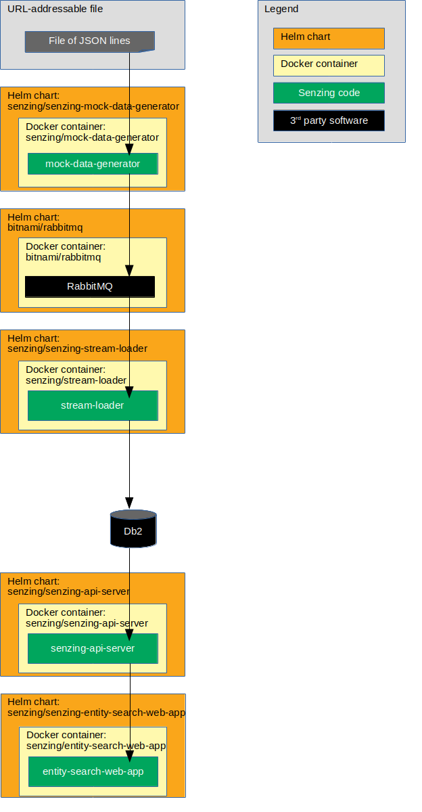

# ibm-openshift-guide-helm-rabbitmq-db2

## Overview

This repository illustrates a reference implementation of Senzing using IBM's Db2 as the underlying database.

The instructions show how to set up a system that:

1. Reads JSON lines from a file on the internet.
1. Sends each JSON line to a message queue.
    1. In this implementation, the queue is RabbitMQ.
1. Reads messages from the queue and inserts into Senzing.
    1. In this implementation, Senzing keeps its data in an IBM Db2 database.
1. Reads information from Senzing via [Senzing REST API](https://github.com/Senzing/senzing-rest-api) server.
1. Views resolved entities in a [web app](https://github.com/Senzing/entity-search-web-app).

The following diagram shows the relationship of the Helm charts, docker containers, and code in this Kubernetes demonstration.



### Contents

1. [Expectations](#expectations)
    1. [Space](#space)
    1. [Time](#time)
    1. [Background knowledge](#background-knowledge)
1. [Prerequisites](#prerequisites)
    1. [Cloud Pak for Data](#cloud-pak-for-data)
    1. [Hardware Requirements](#hardware-requirements)
    1. [Software Requirements](#software-requirements)
    1. [Security Requirements](#security-requirements)
    1. [Clone repository](#clone-repository)
    1. [Database](#database)
1. [Demonstrate](#demonstrate)
    1. [EULA](#eula)
    1. [Set environment variables](#set-environment-variables)
    1. [Database connection information](#database-connection-information)
    1. [Create custom helm values files](#create-custom-helm-values-files)
    1. [Create custom kubernetes configuration files](#create-custom-kubernetes-configuration-files)
    1. [Create persistent volume](#create-persistent-volume)
    1. [Create Service Context Constraint](#create-service-context-constraint)
    1. [Add helm repositories](#add-helm-repositories)
    1. [Deploy Senzing RPM](#deploy-senzing-rpm)
    1. [Install IBM Db2 Driver](#install-ibm-db2-driver)
    1. [Install RabbitMQ Helm chart](#install-rabbitmq-helm-chart)
    1. [Install mock-data-generator Helm chart](#install-mock-data-generator-helm-chart)
    1. [Install senzing-base Helm chart](#install-senzing-base-helm-chart)
    1. [Install Senzing license](#install-senzing-license)
    1. [Get Senzing schema sql for Db2](#get-senzing-schema-sql-for-db2)
    1. [Create Senzing schema on Db2](#create-senzing-schema-on-db2)
    1. [Database tuning](#database-tuning)
    1. [Install init-container Helm chart](#install-init-container-helm-chart)
    1. [Install configurator Helm Chart](#install-configurator-helm-chart)
    1. [Install stream-loader Helm chart](#install-stream-loader-helm-chart)
    1. [Install senzing-api-server Helm chart](#install-senzing-api-server-helm-chart)
    1. [Install senzing-entity-search-web-app Helm chart](#install-senzing-entity-search-web-app-helm-chart)
    1. [View data](#view-data)
1. [Troubleshooting](#troubleshooting)
    1. [Install senzing-debug Helm chart](#install-senzing-debug-helm-chart)
1. [Cleanup](#cleanup)
    1. [Delete everything in project](#delete-everything-in-project)
    1. [Delete database tables](#delete-database-tables)
    1. [Delete git repository](#delete-git-repository)

## Expectations

### Space

This repository and demonstration require 20 GB free disk space.

### Time

Budget 4 hours to get the demonstration up-and-running, depending on CPU and network speeds.

### Background knowledge

This repository assumes a working knowledge of:

1. [Docker](https://github.com/Senzing/knowledge-base/blob/master/WHATIS/docker.md)
1. [Kubernetes](https://github.com/Senzing/knowledge-base/blob/master/WHATIS/kubernetes.md)
1. [OpenShift](https://github.com/Senzing/knowledge-base/blob/master/WHATIS/openshift.md)
1. [Helm](https://github.com/Senzing/knowledge-base/blob/master/WHATIS/helm.md)

## Prerequisites

### Cloud Pak for Data

1. See [Installing Cloud Pak for Data on Red Hat OpenShift (without IBM Cloud Private)](https://docs-icpdata.mybluemix.net/docs/content/SSQNUZ_current/com.ibm.icpdata.doc/zen/install/openshift-noicp.html).

### Hardware Requirements

1. Minimum CPU: FIXME:
1. Minimum Memory:  FIXME:
1. Minimum Storage:  FIXME:
1. Minimum Worker/Master Nodes:  FIXME:
1. Number of Pods/Replicas:  FIXME:

### Software Requirements

1. Storage Software requirements:
    1. Portworx/GlusterFS/NFS FIXME:
1. OS/Virtualizationrequirements: FIXME:
1. Network Virtualization requirements: FIXME:
1. Security Software requirements: FIXME:
1. Third party Software requirements: FIXME:
1. Specific version dependencies: FIXME:

### Security Requirements

1. Permission requirements: FIXME:

### Clone repository

The Git repository has files that will be used in the `helm install --values` parameter.

1. Using these environment variable values:

    ```console
    export GIT_ACCOUNT=senzing
    export GIT_REPOSITORY=ibm-openshift-guide
    export GIT_ACCOUNT_DIR=~/${GIT_ACCOUNT}.git
    export GIT_REPOSITORY_DIR="${GIT_ACCOUNT_DIR}/${GIT_REPOSITORY}"
    ```

1. Follow steps in [clone-repository](https://github.com/Senzing/knowledge-base/blob/master/HOWTO/clone-repository.md) to install the Git repository.

### Database

The following instructions assume that a database has been created for use by Senzing.
The database connection information will be needed for the
"[Database connection information](#database-connection-information)" step below.

## Demonstrate

### EULA

To use the Senzing code, you must agree to the End User License Agreement (EULA).

1. :warning: This step is intentionally tricky and not simply copy/paste.
   This ensures that you make a conscious effort to accept the EULA.
   See
   [SENZING_ACCEPT_EULA](https://github.com/Senzing/knowledge-base/blob/master/lists/environment-variables.md#senzing_accept_eula)
   for the correct value.
   Replace the double-quote character in the example with the correct value.
   The use of the double-quote character is intentional to prevent simple copy/paste.
   Example:

    ```console
    export SENZING_ACCEPT_EULA="
    ```

### Set environment variables

1. :pencil2: Environment variables that need customization.
   Example:

    ```console
    export DEMO_PREFIX=my
    export DEMO_NAMESPACE=zen

    export DOCKER_REGISTRY_URL=docker.io
    export DOCKER_REGISTRY_SECRET=${DOCKER_REGISTRY_URL}-secret
    ```

1. Set environment variables listed in "[Clone repository](#clone-repository)".

1. :thinking: **Optional:** If using Transport Layer Security (TLS),
   then set the following environment variable:

    ```console
    export HELM_TLS="--tls"
    ```

### Database connection information

1. Craft the `SENZING_DATABASE_URL`.  It will be used in "helm values" files.

    Components of the URL:

    ```console
    export DATABASE_USERNAME=<my-username>
    export DATABASE_PASSWORD=<my-password>
    export DATABASE_HOST=<hostname>
    export DATABASE_PORT=<db2-connnection-port>
    export DATABASE_DATABASE=<database-name>
    ```

    :pencil2: Set environment variables.  Example:

    ```console
    export DATABASE_USERNAME=johnsmith
    export DATABASE_PASSWORD=secret
    export DATABASE_HOST=my.database.com
    export DATABASE_PORT=50000
    export DATABASE_DATABASE=G2
    ```

    Construct database URL.  Example:

    ```console
    export SENZING_DATABASE_URL="db2://${DATABASE_USERNAME}:${DATABASE_PASSWORD}@${DATABASE_HOST}:${DATABASE_PORT}/${DATABASE_DATABASE}"

    echo ${SENZING_DATABASE_URL}
    ```

### Create custom helm values files

:thinking: In this step, Helm template files are populated with actual values.
There are two methods of accomplishing this.
Only one method needs to be performed.

1. **Method #1:** Quick method using `envsubst`.
   Example:

    ```console
    export HELM_VALUES_DIR=${GIT_REPOSITORY_DIR}/helm-values
    mkdir -p ${HELM_VALUES_DIR}

    for file in ${GIT_REPOSITORY_DIR}/helm-values-templates/*.yaml; \
    do \
      envsubst < "${file}" > "${HELM_VALUES_DIR}/$(basename ${file})";
    done
    ```

1. **Method #2:** Copy and manually modify files method.
   Example:

    ```console
    export HELM_VALUES_DIR=${GIT_REPOSITORY_DIR}/helm-values
    mkdir -p ${HELM_VALUES_DIR}

    cp ${GIT_REPOSITORY_DIR}/helm-values-templates/* ${HELM_VALUES_DIR}
    ```

    :pencil2: Edit files in ${HELM_VALUES_DIR} replacing the following variables with actual values.

    1. `${DEMO_PREFIX}`
    1. `${DOCKER_REGISTRY_SECRET}`
    1. `${DOCKER_REGISTRY_URL}`
    1. `${SENZING_ACCEPT_EULA}`
    1. `${SENZING_DATABASE_URL}`

### Create custom kubernetes configuration files

:thinking: In this step, Kubernetes template files are populated with actual values.
There are two methods of accomplishing this.
Only one method needs to be performed.

1. **Method #1:** Quick method using `envsubst`.
   Example:

    ```console
    export KUBERNETES_DIR=${GIT_REPOSITORY_DIR}/kubernetes
    mkdir -p ${KUBERNETES_DIR}

    for file in ${GIT_REPOSITORY_DIR}/kubernetes-templates/*; \
    do \
      envsubst < "${file}" > "${KUBERNETES_DIR}/$(basename ${file})";
    done
    ```

1. **Method #2:** Copy and manually modify files method.
   Example:

    ```console
    export KUBERNETES_DIR=${GIT_REPOSITORY_DIR}/kubernetes
    mkdir -p ${KUBERNETES_DIR}

    cp ${GIT_REPOSITORY_DIR}/kubernetes-templates/* ${KUBERNETES_DIR}
    ```

    :pencil2: Edit files in ${KUBERNETES_DIR} replacing the following variables with actual values.

    1. `${DEMO_NAMESPACE}`

### Log into OpenShift

1. :pencil2: Set environment variables.
   **Note:** You may not want to set `OC_PASSWORD` as an environment variable.
   Example:

    ```console
    export OC_USERNAME=my-username
    export OC_PASSWORD=my-password
    export OC_URL=https://xxxx:8443
    ```

1. Login.
   Example:

   ```console
   oc login -u ${OC_USERNAME} -p ${OC_PASSWORD} ${OC_URL}
   ```

### Create OpenShift project

1. :pencil2: Set environment variables.
   **Note:** You may not want to set `OC_PASSWORD` as an environment variable.
   Example:

    ```console
    export OC_DESCRIPTION="My descriptions..."
    export OC_DISPLAY_NAME="My project"
    ```

1. Login.
   Example:

    ```console
    oc new-project ${DEMO_NAMESPACE} \
      --description=${OC_DESCRIPTION} \
      --display-name=${OC_DISPLAY_NAME}
    ```

### Create persistent volume

1. Create persistent volumes.
   Example:

    ```console
    oc create -f ${KUBERNETES_DIR}/persistent-volume-rabbitmq.yaml
    oc create -f ${KUBERNETES_DIR}/persistent-volume-senzing.yaml
    ```

1. Create persistent volume claims.
   Example:

    ```console
    oc create -f ${KUBERNETES_DIR}/persistent-volume-claim-rabbitmq.yaml
    oc create -f ${KUBERNETES_DIR}/persistent-volume-claim-senzing.yaml
    ```

1. :thinking: **Optional:** Review persistent volumes and claims.
   Example:

    ```console
    oc get persistentvolumes \
      --namespace ${DEMO_NAMESPACE}

    oc get persistentvolumeClaims \
      --namespace ${DEMO_NAMESPACE}
    ```

### Create Service Context Constraint

1. Create Security Constraint Context.
   Example:

    ```console
    oc create -f ${KUBERNETES_DIR}/security-context-constraint.yaml
    ```

### Add helm repositories

1. Add Senzing repository.
   Example:

    ```console
    helm repo add senzing https://senzing.github.io/charts/
    ```

1. Update repositories.
   Example:

    ```console
    helm repo update
    ```

1. :thinking: **Optional:**
   Review repositories.
   Example:

    ```console
    helm repo list
    ```

1. Reference: [helm repo](https://helm.sh/docs/helm/#helm-repo)

### Deploy Senzing RPM

This deployment initializes the Persistent Volume with Senzing code and data.

1. Install chart.
   Example:

    ```console
    helm install ${HELM_TLS} \
      --name ${DEMO_PREFIX}-senzing-yum \
      --namespace ${DEMO_NAMESPACE} \
      --values ${HELM_VALUES_DIR}/senzing-yum.yaml \
      senzing/senzing-yum
    ```

1. Add Security Context Constraint.
   Example:

    ```console
    oc adm policy add-scc-to-user FIXME: -z ${DEMO_PREFIX}-senzing-yum
    ```

### Install IBM Db2 Driver

This deployment adds the IBM Db2 Client driver code to the Persistent Volume.

1. Install chart.
   Example:

    ```console
    helm install ${HELM_TLS} \
      --name ${DEMO_PREFIX}-ibm-db2-driver-installer \
      --namespace ${DEMO_NAMESPACE} \
      --values ${HELM_VALUES_DIR}/ibm-db2-driver-installer.yaml \
      senzing/ibm-db2-driver-installer
    ```

1. Add Security Context Constraint.
   Example:

    ```console
    oc adm policy add-scc-to-user FIXME: -z ${DEMO_PREFIX}-ibm-db2-driver-installer
    ```

### Install RabbitMQ Helm chart

This deployment creates a RabbitMQ service.

1. Install chart.
   Example:

    ```console
    helm install ${HELM_TLS} \
      --name ${DEMO_PREFIX}-rabbitmq \
      --namespace ${DEMO_NAMESPACE} \
      --values ${HELM_VALUES_DIR}/rabbitmq.yaml \
      stable/rabbitmq
    ```

1. Add Security Context Constraint.
   Example:

    ```console
    oc adm policy add-scc-to-user FIXME: -z ${DEMO_PREFIX}-rabbitmq
    ```

1. Wait for pods to run.
   Example:

    ```console
    oc get pods \
      --namespace ${DEMO_NAMESPACE} \
      --watch
    ```

1. To view RabbitMQ, see [View RabbitMQ](#view-rabbitmq)

### Install mock-data-generator Helm chart

The mock data generator pulls JSON lines from a file and pushes them to RabbitMQ.

1. Install chart.
   Example:

    ```console
    helm install ${HELM_TLS} \
      --name ${DEMO_PREFIX}-senzing-mock-data-generator \
      --namespace ${DEMO_NAMESPACE} \
      --values ${HELM_VALUES_DIR}/mock-data-generator-rabbitmq.yaml \
      senzing/senzing-mock-data-generator
    ```

### Install senzing-base Helm Chart

This deployment provides a pod that is used to copy files to and from the Persistent Volume
in later steps.

1. Install chart.
   Example:

    ```console
    helm install ${HELM_TLS} \
      --name ${DEMO_PREFIX}-senzing-base \
      --namespace ${DEMO_NAMESPACE} \
      --values ${HELM_VALUES_DIR}/senzing-base.yaml \
       senzing/senzing-base
    ```

1. Add Security Context Constraint.
   Example:

    ```console
    oc adm policy add-scc-to-user FIXME: -z ${DEMO_PREFIX}-senzing-base
    ```

1. Find pod name.
   Example:

    ```console
    export SENZING_BASE_POD_NAME=$(oc get pods \
      --namespace ${DEMO_NAMESPACE} \
      --output jsonpath="{.items[0].metadata.name}" \
      --selector "app.kubernetes.io/name=senzing-base, \
                  app.kubernetes.io/instance=${DEMO_PREFIX}-senzing-base" \
      )
    ```

1. Wait for pods to run.
   Example:

    ```console
    oc get pods \
      --namespace ${DEMO_NAMESPACE} \
      --watch
    ```

### Install Senzing license

:thinking: **Optional:**
Senzing comes with a trial license that supports 10,000 records.
If this is sufficient, there is no need to install a new license
and this step may be skipped.

1. If working with more than 10,000 records,
   [obtain a Senzing license](https://github.com/Senzing/knowledge-base/blob/master/HOWTO/obtain-senzing-license.md).

1. Be sure the `senzing-base` Helm Chart has been installed and is running.
   See "[Install senzing-base Helm Chart](#install-senzing-base-helm-chart)".

1. Copy the `g2.lic` file to the `senzing-debug` pod
   at `/opt/senzing/g2/data/g2.lic`.

    :pencil2: Identify location of `g2.lic` on local workstation.
    Example:

    ```console
    export G2_LICENSE_PATH=/path/to/local/g2.lic
    ```

    Copy file to debug pod.
    Example:

    ```console
    oc cp \
      --namespace ${DEMO_NAMESPACE} \
      ${G2_LICENSE_PATH} \
      ${DEMO_NAMESPACE}/${SENZING_BASE_POD_NAME}:/opt/senzing/senzing-etc/g2.lic
    ```

1. Note: `/etc/opt/senzing` is attached as a Kubernetes Persistent Volume Claim (PVC),
   so the license will be seen by all pods that attach to the PVC.

### Get Senzing schema sql for Db2

The step copies the SQL file used to create the Senzing database schema onto the local workstation.

1. Be sure the `senzing-base` Helm Chart has been installed and is runnning.
   See "[Install senzing-base Helm Chart](#install-senzing-base-helm-chart)".

1. Copy the `/opt/senzing/g2/resources/schema/g2core-schema-db2-create.sql`
   file from the `senzing-base` pod.

    :pencil2: Identify location to place `g2core-schema-db2-create.sql` on local workstation.
    Example:

    ```console
    export SENZING_LOCAL_SQL_PATH=/path/to/local/g2core-schema-db2-create.sql
    ```

    Copy file from pod to local workstation.
    Example:

    ```console
    oc cp \
      --namespace ${DEMO_NAMESPACE} \
      ${DEMO_NAMESPACE}/${SENZING_BASE_POD_NAME}:/opt/senzing/senzing-g2/resources/schema/g2core-schema-db2-create.sql \
      ${SENZING_LOCAL_SQL_PATH}
    ```

### Create Senzing schema on Db2

1. Copy `g2core-schema-db2-create.sql` to a system that can access the database created for Senzing.
   Example:

   ```console
   scp ${SENZING_LOCAL_SQL_PATH} db2inst1@10.176.116.45:
   ```

1. If needed, create a database for Senzing data.
   Example:

    ```console
    su - db2inst1
    export DB2_DATABASE=G2

    source sqllib/db2profile
    db2 create database ${DB2_DATABASE} using codeset utf-8 territory us
    ```

1. Connect to `DB2_DATABASE`.
   Example:

    ```console
    su - db2inst1
    export DB2_DATABASE=G2
    export DB2_USER=db2inst1

    source sqllib/db2profile
    db2 connect to ${DB2_DATABASE} user ${DB2_USER}
    ```

    When requested, supply password.

1. Create tables in schema.
   Example:

    ```console
    db2 -tvf g2core-schema-db2-create.sql
    db2 terminate
    ```

### Database tuning

**FIXME:** Continue to improve.

1. For information on tuning the database for optimum performance, see
   [Tuning your Database](https://senzing.zendesk.com/hc/en-us/articles/360016288254-Tuning-your-Database).

1. Additional tuning parameters to try:

    ```console
    db2set DB2_USE_ALTERNATE_PAGE_CLEANING=ON
    db2set DB2_APPENDERS_PER_PAGE=1
    db2set DB2_INLIST_TO_NLJN=YES
    db2set DB2_LOGGER_NON_BUFFERED_IO=ON
    db2set DB2_SKIP_LOG_WAIT=YES
    db2set DB2_APM_PERFORMANCE=off
    db2set DB2_SKIPLOCKED_GRAMMAR=YES
    ```

1. Additional tuning parameters to try:

    ```console
    db2 connect to ${DB2_DATABASE} user ${DB2_USER}

    db2 UPDATE SYS_SEQUENCE SET CACHE_SIZE=100000
    db2 commit
    ```

### Install init-container Helm chart

The init-container creates files from templates and initializes the G2 database.

1. Install chart.
   Example:

    ```console
    helm install ${HELM_TLS} \
      --name ${DEMO_PREFIX}-senzing-init-container \
      --namespace ${DEMO_NAMESPACE} \
      --values ${HELM_VALUES_DIR}/init-container-db2.yaml \
      senzing/senzing-init-container
    ```

1. Add Security Context Constraint.
   Example:

    ```console
    oc adm policy add-scc-to-user FIXME: -z ${DEMO_PREFIX}-senzing-init-container
    ```

1. Wait for pods to run.
   Example:

    ```console
    oc get pods \
      --namespace ${DEMO_NAMESPACE} \
      --watch
    ```

### Install configurator Helm chart

The Senzing Configurator is a micro-service for changing Senzing configuration.

1. Install chart.
   Example:

    ```console
    helm install ${HELM_TLS} \
      --name ${DEMO_PREFIX}-senzing-configurator \
      --namespace ${DEMO_NAMESPACE} \
      --values ${HELM_VALUES_DIR}/configurator.yaml \
      senzing/senzing-configurator
    ```

1. To view Senzing Configurator, see [View Senzing Configurator](#view-senzing-configurator).

### Install stream-loader Helm chart

The stream loader pulls messages from RabbitMQ and sends them to Senzing.

1. Install chart.
   Example:

    ```console
    helm install ${HELM_TLS} \
      --name ${DEMO_PREFIX}-senzing-stream-loader \
      --namespace ${DEMO_NAMESPACE} \
      --values ${HELM_VALUES_DIR}/stream-loader-rabbitmq-db2.yaml \
      senzing/senzing-stream-loader
    ```

### Install senzing-api-server Helm chart

The Senzing API server receives HTTP requests to read and modify Senzing data.

1. Install chart.
   Example:

    ```console
    helm install ${HELM_TLS} \
      --name ${DEMO_PREFIX}-senzing-api-server \
      --namespace ${DEMO_NAMESPACE} \
      --values ${HELM_VALUES_DIR}/senzing-api-server.yaml \
      senzing/senzing-api-server
    ```

1. Wait for pods to run.
   Example:

    ```console
    oc get pods \
      --namespace ${DEMO_NAMESPACE} \
      --watch
    ```

1. To view Senzing API server, see [View Senzing API Server](#view-senzing-api-server).

### Install senzing-entity-search-web-app Helm chart

The Senzing Entity Search WebApp is a light-weight WebApp demonstrating Senzing search capabilities.

1. Install chart.
   Example:

    ```console
    helm install ${HELM_TLS} \
      --name ${DEMO_PREFIX}-senzing-entity-search-web-app \
      --namespace ${DEMO_NAMESPACE} \
      --values ${HELM_VALUES_DIR}/entity-search-web-app.yaml \
      senzing/senzing-entity-search-web-app
    ```

1. Wait for pod to run.
   Example:

    ```console
    oc get pods \
      --namespace ${DEMO_NAMESPACE} \
      --watch
    ```

1. To view Senzing Entity Search WebApp, see [View Senzing Entity Search WebApp](#view-senzing-entity-search-webapp).

### View data

1. Username and password for the following sites are the values seen in the corresponding "values" YAML file located in
   [helm-values-templates](../helm-values-templates).
1. :pencil2: When using a separate terminal window in each of the examples below, set environment variables.
   Example:

    ```console
    export DEMO_PREFIX=my
    export DEMO_NAMESPACE=zen
    ```

#### View RabbitMQ

FIXME:

1. In a separate terminal window, port forward to local machine.
   Example:

    ```console
    oc port-forward \
      --address 0.0.0.0 \
      --namespace ${DEMO_NAMESPACE} \
      svc/${DEMO_PREFIX}-rabbitmq 15672:15672
    ```

1. RabbitMQ will be viewable at [localhost:15672](http://localhost:15672).
    1. Login
        1. See `helm-values/rabbitmq.yaml` for Username and password.

#### View Senzing Configurator

FIXME:

1. In a separate terminal window, port forward to local machine.
   Example:

    ```console
    oc port-forward \
      --address 0.0.0.0 \
      --namespace ${DEMO_NAMESPACE} \
      svc/${DEMO_PREFIX}-senzing-configurator 5001:5000
    ```

1. Make HTTP calls via `curl`.
   Example:

    ```console
    export SENZING_CONFIGURATOR_SERVICE=http://localhost:5001

    curl -X GET ${SENZING_CONFIGURATOR_SERVICE}/datasources
    curl -X POST \
      --data '[ "TEST", "TEST1", "TEST2", "TEST3"]' \
      --header 'Content-type: application/json;charset=utf-8' \
      ${SENZING_CONFIGURATOR_SERVICE}/datasources
    ```

#### View Senzing API Server

FIXME:

1. In a separate terminal window, port forward to local machine.
   Example:

    ```console
    oc port-forward \
      --address 0.0.0.0 \
      --namespace ${DEMO_NAMESPACE} \
      svc/${DEMO_PREFIX}-senzing-api-server 8889:8080
    ```

1. Make HTTP calls via `curl`.
   Example:

    ```console
    export SENZING_API_SERVICE=http://localhost:8889

    curl -X GET ${SENZING_API_SERVICE}/heartbeat
    curl -X GET ${SENZING_API_SERVICE}/license
    curl -X GET ${SENZING_API_SERVICE}/entities/1
    ```

#### View Senzing Entity Search WebApp

FIXME:

1. In a separate terminal window, port forward to local machine.
   Example:

    ```console
    oc port-forward \
      --address 0.0.0.0 \
      --namespace ${DEMO_NAMESPACE} \
      svc/${DEMO_PREFIX}-senzing-entity-search-web-app 8888:80
    ```

1. Senzing Entity Search WebApp will be viewable at [localhost:8888](http://localhost:8888).
   The [demonstration](https://github.com/Senzing/knowledge-base/blob/master/demonstrations/docker-compose-web-app.md)
   instructions will give a tour of the Senzing web app.

## Troubleshooting

### Install senzing-debug Helm chart

This deployment provides a pod that can be used to view Persistent Volumes.

1. Install chart.
   Example:

    ```console
    helm install ${HELM_TLS} \
      --name ${DEMO_PREFIX}-senzing-debug \
      --namespace ${DEMO_NAMESPACE} \
      --values ${HELM_VALUES_DIR}/senzing-debug.yaml \
       senzing/senzing-debug
    ```

1. Add Security Context Constraint.
   Example:

    ```console
    oc adm policy add-scc-to-user FIXME: -z ${DEMO_PREFIX}-senzing-debug
    ```

1. Wait for pod to run.
   Example:

    ```console
    oc get pods \
      --namespace ${DEMO_NAMESPACE} \
      --watch
    ```

1. Find pod name.
   Example:

    ```console
    export SENZING_DEBUG_POD_NAME=$(oc get pods \
      --namespace ${DEMO_NAMESPACE} \
      --output jsonpath="{.items[0].metadata.name}" \
      --selector "app.kubernetes.io/name=senzing-debug, \
                  app.kubernetes.io/instance=${DEMO_PREFIX}-senzing-debug" \
      )
    ```

1. Log into debug pod.
   Example:

    ```console
    oc exec -it --namespace ${DEMO_NAMESPACE} ${SENZING_DEBUG_POD_NAME} -- /bin/bash
    ```

## Cleanup

### Delete everything in project

1. Example:

    ```console
    helm delete --purge ${DEMO_PREFIX}-senzing-entity-search-web-app
    helm delete --purge ${DEMO_PREFIX}-senzing-api-server
    helm delete --purge ${DEMO_PREFIX}-senzing-stream-loader
    helm delete --purge ${DEMO_PREFIX}-senzing-configurator
    helm delete --purge ${DEMO_PREFIX}-senzing-init-container
    helm delete --purge ${DEMO_PREFIX}-senzing-base
    helm delete --purge ${DEMO_PREFIX}-ibm-db2-driver-installer
    helm delete --purge ${DEMO_PREFIX}-senzing-yum
    helm delete --purge ${DEMO_PREFIX}-senzing-mock-data-generator
    helm delete --purge ${DEMO_PREFIX}-rabbitmq
    helm delete --purge ${DEMO_PREFIX}-senzing-debug
    helm repo remove senzing
    oc delete -f ${KUBERNETES_DIR}/persistent-volume-claim-senzing.yaml
    oc delete -f ${KUBERNETES_DIR}/persistent-volume-claim-rabbitmq.yaml
    oc delete -f ${KUBERNETES_DIR}/persistent-volume-senzing.yaml
    oc delete -f ${KUBERNETES_DIR}/persistent-volume-rabbitmq.yaml
    ```

### Delete database tables

1. **FIXME:** Example:

### Delete git repository

1. Delete git repository.  Example:

    ```console
    sudo rm -rf ${GIT_REPOSITORY_DIR}
    ```
